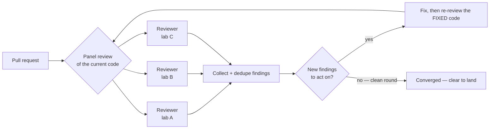

# buddhi-review

A **free, MIT-licensed PR review-and-fix loop for Claude Code**, built on the public
[Buddhi kernel](https://github.com/buddhikernel/buddhi). It fans out your review
bots, classifies every comment, applies the fixes, re-reviews until the PR is clean,
and merges it when you opt in.

**Buddhi lands your PRs.** Think of a pull request as a flight: it takes off, flies
the review rounds, and comes in clean, ready to land (merge) on the base branch.
Along the way Buddhi reads the review comments left by your bots, classifies each
one, and lets the kernel decide what to do with it: apply a fix, ask you a question,
skip it, or defer it when the day's interrupt budget is spent. You answer any
questions right in your terminal.

New here? **[Getting started](https://github.com/buddhikernel/buddhi-review/blob/main/GETTING_STARTED.md)**
walks you from `pip install` through your first reviewed PR.

## Why a panel, and why rounds

Buddhi doesn't hand your PR to one reviewer. It fans it out to a panel of independent
models from *different* labs, and keeps flying review rounds until a round comes back
clean. Three reasons that beats one strong reviewer running once.

**Different labs, different blind spots.** You have probably watched one reviewer flag
a real bug another signed off on. Across many PRs that stops being luck and becomes the
whole point: models trained by different labs, on different data, fail *differently* —
so where one is blind, another tends to see. This is the ensemble-diversity result (a
panel's misses shrink the less its members' errors overlap), and it has been measured
on today's models: same-vendor models make *more correlated* errors than cross-vendor
ones [[1](https://arxiv.org/abs/2506.07962)]. A model is also soft on its own work — it
rates its own output more favorably than another model's
[[2](https://arxiv.org/abs/2404.13076)] — so a reviewer from a *different* family is not
just a second pair of eyes, it is a less self-flattering one.

**A fix is a new change — so it needs a fresh look.** When a fixer resolves a round-1
comment, it edits the code, and an edit can be wrong or introduce a new bug that exists
*only because* of the fix. Re-reading the *fixed* code catches regressions the first
pass could not have seen — and the review that counts most is by a *different* model
than the one that wrote the fix, for the self-preference reason above. That is the real
answer to "the bots already fixed round 1, so why loop?": a model re-reading its own fix
is grading its own homework.

**It converges on a clean round — not on a fixed count, and not on "zero findings."**
More rounds are not automatically better: repeated review tends to plateau within a few
rounds, and pushing past that entrenches noise instead of removing it
[[3](https://arxiv.org/abs/2305.14325)]. So Buddhi does not loop a set number of times.
Each round it re-summons the reviewers on the *fixed* code, acts on the findings they
raise — fixing the substantive and the cosmetic ones alike — and goes again. Convergence
is the round that comes back with **no new findings to act on**: not the reviewers
falling silent, and not a count that started at zero, but the loop having resolved
everything actionable, cosmetic nits included. Two guardrails keep it honest: there is
always at least one confirmation round after the last fix, so a fix never lands
unreviewed, and the round budget scales with the size of the change (a one-line tweak
gets a couple of rounds, a thousand-line diff earns more). Convergence is not the same as
escalation: when a comment genuinely needs your judgment, Buddhi asks you instead — a
separate mechanism, described in [*When it asks you*](#when-it-asks-you) below. (Buddhi
claims nothing more: no model here is superhuman, and agreement between models is not
proof of correctness — a diverse panel reviewing to a clean round simply catches more
than one reviewer running once.)



<details>
<summary><b>The research behind this</b></summary>

- **Ensemble diversity / error decorrelation** — a group's error shrinks in proportion
  to how *uncorrelated* its members' mistakes are. Classical roots: Krogh & Vedelsby,
  *Neural Network Ensembles* (NeurIPS 1995); the Condorcet Jury Theorem; Surowiecki,
  *The Wisdom of Crowds* (2004).
- **[1] Same-vendor models are more error-correlated than cross-vendor ones** — Kim et
  al., [*Correlated Errors in Large Language Models*](https://arxiv.org/abs/2506.07962).
  Honest caveat from the same paper: that decorrelation *shrinks* for the largest,
  most-accurate models — cross-vendor diversity helps, but it is not a free lunch at the
  frontier, which is part of why Buddhi does not just stack rounds forever.
- **[2] Self-preference bias** — Panickssery et al.,
  [*LLM Evaluators Recognize and Favor Their Own Generations*](https://arxiv.org/abs/2404.13076):
  an LLM rates text it wrote more favorably than another model's.
- **[3] Rounds plateau** — multi-agent debate gains saturate after a few rounds (Du et
  al., [*Improving Factuality and Reasoning through Multiagent Debate*](https://arxiv.org/abs/2305.14325));
  pushing further tends to entrench errors rather than remove them.
- **Why Buddhi *unions and dedupes* findings rather than making models vote** — voting
  correlated judges caps out fast (even ~9 diverse LLM judges behave like ~2 independent
  votes: Kohli, [*Nine Judges, Two Effective Votes*](https://arxiv.org/abs/2605.29800)),
  whereas a diverse cross-vendor panel beats a single strong judge in LLM *evaluation*
  (Cohere, [*Replacing Judges with Juries* / PoLL](https://arxiv.org/abs/2404.18796)).
  Finding bugs is a *coverage* problem — keep every reviewer's real catch — not a
  majority vote, so Buddhi takes the union and skips the voting ceiling.

</details>

## Seen in real runs — not just in papers

The research above predicts two things: reviewers are less effective at evaluating
their own work, and many bugs emerge only through repeated fix-and-review rounds. Six
real Buddhi runs — covering changes authored with Claude Code and measured using the
review loop's per-bug ledger — show both effects clearly.

### "Just have Claude review it again" is not adversarial review

When Claude reviewed Claude-written code as one member of a multi-model panel, it
caught 13 of 178 valid bugs (7.3%). The reviewers from other vendors collectively
caught 92.7%, and more than 90% of the high- or critical-severity bugs found in round
2 or later were caught by a non-Claude reviewer.

This is the self-preference effect described in
[[2](https://arxiv.org/abs/2404.13076)], made visible in real review runs: a model
reviewing its own work misses most of what a diverse panel catches.


### One round is not a complete review

Across the six runs, 77% of valid bugs — and 76% of high- or critical-severity bugs —
were discovered only in round 2 or later, after the initial fixes had been applied and
the changed code reviewed again. Depending on the run, the share found after round 1
ranged from 50% to 81%.

Built-in review features that post one round of comments and stop cannot catch issues
that become visible only after earlier findings have been fixed.


<details>
<summary><b>The data behind the charts</b></summary>

| Run | Valid bugs | Caught by Claude | Claude % | Caught in R2+ | R2+ % | High/critical | High/crit in R2+ |
|---|---|---|---|---|---|---|---|
| A | 42 | 2 | 4.8% | 34 | 81.0% | 19 | 14 (73.7%) |
| B | 26 | 7 | 26.9% | 20 | 76.9% | 16 | 12 (75.0%) |
| C | 29 | 1 | 3.4% | 22 | 75.9% | 8 | 8 (100%) |
| D | 24 | 0&dagger; | 0.0% | 19 | 79.2% | 6 | 5 (83.3%) |
| E | 12 | 1 | 8.3% | 6 | 50.0% | 8 | 5 (62.5%) |
| F | 45 | 2 | 4.4% | 36 | 80.0% | 18 | 13 (72.2%) |
| **All** | **178** | **13** | **7.3%** | **137** | **77.0%** | **75** | **57 (76.0%)** |

&dagger; In Run D, Claude reviewed and posted an explicit all-clear ("No issues
found.") in round 1 — the panel then caught 24 valid bugs, six of them
high-severity.

How to read this honestly:

- The six runs are merged review loops on one private repository (anonymized); the
  numbers come from the loop's own per-bug ledger, which records each verified, fixed
  bug with its severity, the reviewer that caught it, and the round it was caught in.
- Severity is assigned by the loop's classifier — which itself runs on Claude — so the
  low Claude share cannot be an anti-Claude bias in the rater.
- Each bug is credited to one catching reviewer. Claude's raw comment counts on the
  underlying PRs corroborate the ledger's counts, so attribution is not hiding Claude
  catches.
- Reviewer fleets vary per run (not every vendor reviewed every run). One additional
  run was excluded because Claude was disabled by configuration and never reviewed.
- This is an illustrative sample from real usage, not a controlled benchmark. As this
  repository accumulates its own public review loops, these charts will be replaced
  with runs anyone can inspect on GitHub.

</details>

## What it is

Buddhi splits a PR review into two halves: the decision, and the I/O around it. The
[Buddhi kernel](https://github.com/buddhikernel/buddhi) makes the decision — for each
review comment it decides whether to fix it, ask you, skip it, or defer it.
`buddhi-review` is the **adapter** that does everything around that decision on the
GitHub side: it reads the comments off your PR, hands each one to the kernel, and
carries out whatever the kernel returns. Concretely, for each comment the loop:

1. **Classifies** it into one of six labels: `SUBSTANTIVE`, `COSMETIC`,
   `BUSINESS_QUESTION`, `PR_DESCRIPTION`, `OUTDATED`, `INVALID`. If the classifier
   can't produce a usable label, the comment becomes a synthetic
   `CLASSIFICATION_FAILED` and is escalated to you when the interrupt budget allows,
   otherwise deferred — so a comment is never silently lost just because it could not
   be classified.
2. **Maps** the label onto a kernel work item and runs it through the kernel's
   seven decisions.
3. **Acts** on the kernel's disposition:

   | Kernel disposition | What happens |
   |---|---|
   | fix | dispatch a fixer (SUBSTANTIVE / COSMETIC) |
   | escalate | ask you via the console answer-file channel (BUSINESS_QUESTION / PR_DESCRIPTION / classifier failure) |
   | skip | do nothing (OUTDATED / INVALID) |
   | defer | the day's human-interrupt budget is spent: hold the item, never drop it |
   | already-resolved | the comment was already resolved before the loop reached it — no action taken |

The disposition is the **kernel's** call, not a pile of hand-tuned `if` branches in
the adapter — `buddhi-review` only carries out the I/O; every decision stays in the
kernel.

## When it asks you

The kernel asks you only when a review comment can't be settled by the code plus your
project's own docs, conventions, and PR description — when resolving it would mean
making a call that is really yours. In practice that is a question about product
direction, scope, or a business rule the docs don't answer; a genuinely ambiguous
technical fork with more than one defensible answer and nothing in the repo to choose
between; or a taste call about user-facing wording or design that the docs leave open.
Anything the code and docs already settle, the loop handles on its own without
interrupting you.

Two additional cases always route to you regardless of the docs: a `PR_DESCRIPTION`
comment (a reviewer asked you to update the PR body itself) and a
`CLASSIFICATION_FAILED` comment (the classifier could not produce a usable label).
Both escalate when your interrupt budget allows, and defer rather than drop if it
doesn't.

When it does need you, the question is written to an editable answer file: the loop
prints a `file://` link, you type a number (or free text) on the `>` line and save,
and the loop picks it up. Everything happens locally.

The notifier is a small, swappable interface, so an alternative delivery channel
can be wired in later without touching the review loop.

## Install

```bash
pip install buddhi-review
```

This pulls the kernel ([`buddhikernel`](https://github.com/buddhikernel/buddhi)) and
`PyYAML`, and installs the `buddhi-review` command. The two slash-command skills it
backs — **`/review-pr`** (review an open PR) and **`/create-pr`** (open a PR, then
review it) — ship inside the package but are **not** added to Claude Code
automatically; install them as Claude Code **skills** (each becomes
`~/.claude/skills/<name>/SKILL.md`):

```bash
SKILLS=$(python3 -c "import buddhi_review, os; print(os.path.join(os.path.dirname(buddhi_review.__file__), 'skills'))" 2>/dev/null)
if [ -d "$SKILLS" ]; then
  mkdir -p ~/.claude/skills/
  rm -rf ~/.claude/skills/review-pr ~/.claude/skills/create-pr
  cp -R "$SKILLS"/review-pr "$SKILLS"/create-pr ~/.claude/skills/
  echo "✓ Skills installed to ~/.claude/skills/ — restart Claude Code to load them"
else
  echo "✗ Error: Could not locate buddhi_review skills. Ensure buddhi-review is installed in the active Python environment."
fi
```

**Restart Claude Code** so it loads the new skills, then run **`/review-pr setup`**
once to onboard (see [Getting started](https://github.com/buddhikernel/buddhi-review/blob/main/GETTING_STARTED.md)).
If a slash-command of the same name already exists, the skill takes precedence.

Each skill's `SKILL.md` frontmatter includes a **git-guardrail hook** that stops the
agent from hand-running history-rewriting git (rebase / merge / reset --hard /
cherry-pick / force-push) while a review is in flight; it activates only when the
skill runs and leaves your everyday git untouched.

To work from a clone instead (for development or to run the tests):

```bash
pip install -e ".[test]"
python3 -m pytest -q
```

## Quickstart

```bash
# 1. Health check — runs the kernel-driven pipeline on built-in fixtures.
#    No network, no `claude`; proves the kernel decides every disposition.
python3 -m buddhi_review self-check
```

```text
buddhi_review <version> — kernel-driven self-check


[Clearance — a decision the loop needs from you] How should item 'c4' be handled?
  1. Apply the suggested change
  2. Skip — the suggestion is not valid here
  3. Defer — this needs your judgment
  answer here → file:///…/review-answer-local-c4.md

[Clearance — a decision the loop needs from you] How should item 'c5' be handled?
  1. Apply the suggested change
  2. Skip — the suggestion is not valid here
  3. Defer — this needs your judgment
  answer here → file:///…/review-answer-local-c5.md

[Clearance — a decision the loop needs from you] How should item 'c6' be handled?
  1. Apply the suggested change
  2. Skip — the suggestion is not valid here
  3. Defer — this needs your judgment
  answer here → file:///…/review-answer-local-c6.md
  [ok ] SUBSTANTIVE          kernel=MODEL_HANDLED disposition=fix            (want fix)
  [ok ] COSMETIC             kernel=MODEL_HANDLED disposition=fix            (want fix)
  [ok ] OUTDATED             kernel=DISCARDED     disposition=skip           (want skip)
  [ok ] INVALID              kernel=DISCARDED     disposition=skip           (want skip)
  [ok ] BUSINESS_QUESTION    kernel=ESCALATED     disposition=escalate       (want escalate)
  [ok ] PR_DESCRIPTION       kernel=ESCALATED     disposition=escalate       (want escalate)
  [ok ] CLASSIFICATION_FAILED kernel=ESCALATED     disposition=escalate       (want escalate)

SELF-CHECK OK — the kernel decided every disposition.
```

The three `[Clearance …]` panels are expected: the self-check feeds the kernel its
escalation fixtures (`BUSINESS_QUESTION`, `PR_DESCRIPTION`, and a forced classifier
failure), so it writes each one's answer file (and immediately cleans it up) before
printing the results table. A clean run still ends with `SELF-CHECK OK`.

```bash
# 2. One-time onboarding (plan, repo, reviewer fleet).
/review-pr setup

# 3. Review an open PR.
/review-pr <pr>

# 4. Open a PR from your local work and review it in one step.
/create-pr
```

You can also drive the CLI directly:

```bash
python3 -m buddhi_review review-pr 123 --repo OWNER/REPO --cwd /path/to/checkout
```

or detach it as a background loop and follow its log:

```bash
LAUNCHER=$(python3 -c "import os, buddhi_review; print(os.path.join(os.path.dirname(buddhi_review.__file__), 'launch-review.sh'))" 2>/dev/null)
if [ -f "$LAUNCHER" ]; then
  bash "$LAUNCHER" 123 --repo OWNER/REPO --cwd /path/to/checkout
fi
```

## What a review costs you

Buddhi is free and MIT-licensed, but **the reviews it runs spend your own provider
quotas.** Buddhi never bills you and never proxies a review through an account of its
own. Each reviewer draws on a plan you already hold, and the loop's own classify and
fix calls run on your machine against your Claude subscription:

| Surface | Whose meter it spends |
|---|---|
| **Copilot review** | Your **GitHub AI credits** (a paid GitHub Copilot plan). |
| **`claude[bot]` review** | Your **GitHub Actions minutes** on a private repo (the bundled `claude-code-review.yml` workflow runs on each summon; public repos on standard runners are free) plus your Claude subscription (`CLAUDE_CODE_OAUTH_TOKEN`) or pay-as-you-go API credit (`ANTHROPIC_API_KEY`) — whichever the repo secret holds. |
| **Codex review** | Your **ChatGPT plan** (the OpenAI Codex GitHub app). |
| **Gemini review** | Your **Gemini Code Assist** entitlement. |
| **The loop's own classify / fix calls** | Your **Claude subscription**: the loop drives the local `claude` CLI to classify each comment and apply fixes. |

Check or cap your GitHub-side spend at
**[github.com/settings/billing/summary](https://github.com/settings/billing/summary)**.
Enable only the reviewers whose plans you hold. `/review-pr setup` subtracts the rest,
so no trigger fires into a void and nothing is spent on a reviewer you do not run. See
[Getting started](https://github.com/buddhikernel/buddhi-review/blob/main/GETTING_STARTED.md#what-a-review-costs-you)
for the full breakdown.

## Status

buddhi-review is in **alpha**: the CLI flags, output format, and Python API may
change between releases, with no semantic-versioning guarantees before v1.0. It has
been exercised end to end but not yet hardened across a wide range of repositories,
so expect rough edges. Issues and PRs are welcome.

Run the test suite with `pip install -e ".[test]" && python3 -m pytest -q`.

## Architecture

`buddhi-review` is an adapter of the Buddhi kernel onto the GitHub PR-review substrate.

- **The four-verb adapter** (`buddhi_review/adapter.py`) implements the kernel's
  `Adapter` contract: `ingest` (yield the PR's raw comments), `run_embedded`
  (Stage-0 condition one item, then run the seven decisions), `escalate_async`
  (deliver a pre-reasoned ask), and `detect_resolved` (observe a *signaled*
  out-of-band resolution).
- **The five seams** (`buddhi_review/seams.py` + `policy.py`) are the concrete
  implementations the kernel calls back through:
  - **Store**: interrupt counters plus the two-tier exclusion lattice (quota and
    PR-too-large are permanent; an errored bot is transient and comes back on its
    next substantive comment).
  - **Router**: a stakes-based effort recommendation.
  - **Escalation**: translates the kernel's pre-reasoned ask into a
    channel-agnostic ask and delivers it over the console channel.
  - **OOB source**: declares the substrate can observe a *signaled* resolution.
  - **PolicyPack**: the single policy contract, bundling the discard predicate, the
    effort taxonomy, the judgment threshold, the validity rule, the ask phrasings,
    and the bounded interrupt budget.

Nothing domain-specific lives in the kernel; it all enters through the policy pack
and the seams. See the [Buddhi kernel](https://github.com/buddhikernel/buddhi) for
the kernel's own design.

## License

MIT. See [LICENSE](https://github.com/buddhikernel/buddhi-review/blob/main/LICENSE).

This package depends on the [Buddhi kernel](https://github.com/buddhikernel/buddhi)
(`buddhikernel`), which is licensed under Apache-2.0.
