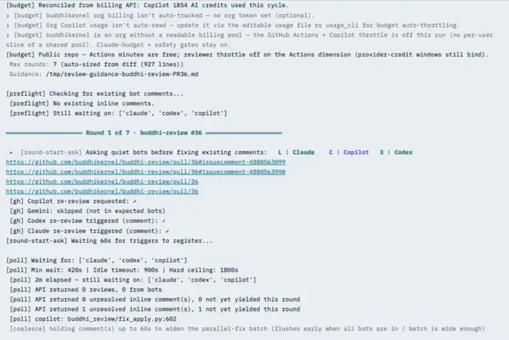
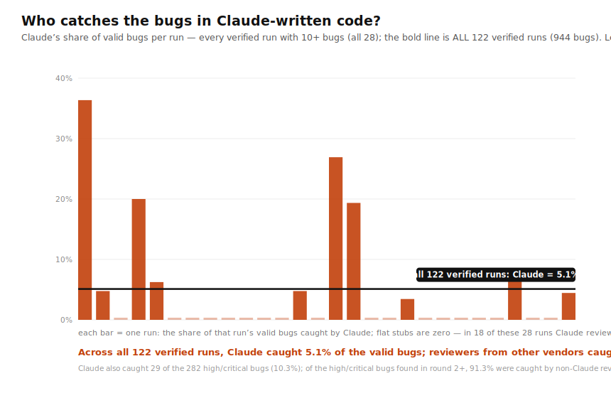
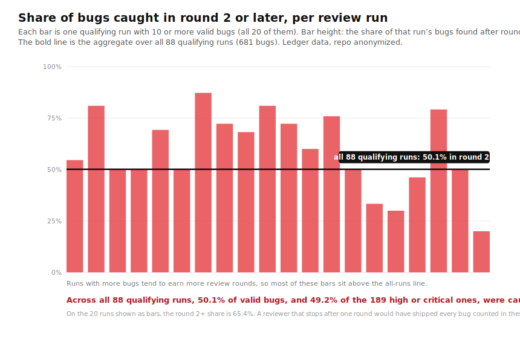
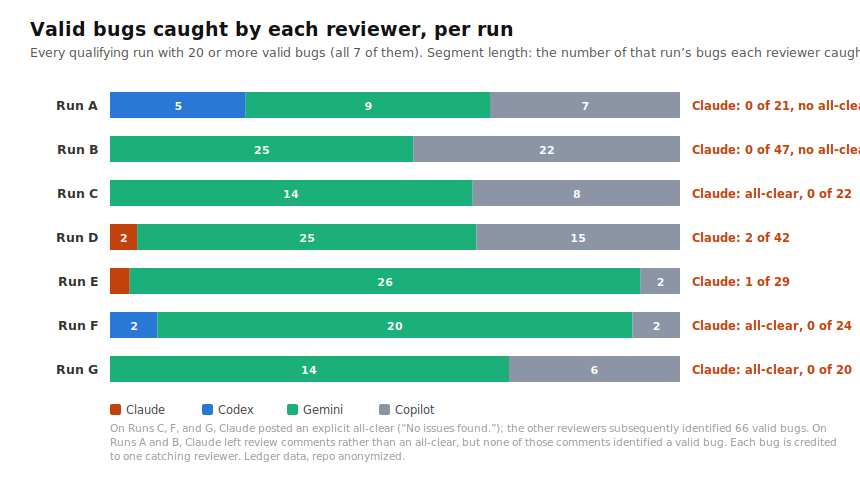

# buddhi-review

`buddhi-review` is a **free, MIT-licensed PR review-and-fix loop for Claude Code**,
built on the public [Buddhi kernel](https://github.com/buddhikernel/buddhi). It
sends each PR to a cross-vendor panel of AI reviewers, classifies their findings,
applies fixes, and repeats until the pull request is ready to land. It auto-merges
only when you opt in.

**One model reviewing its own work once is not enough.** LLMs tend to evaluate their
own output more favorably, and a single review pass can leave many bugs undiscovered.
That is why Buddhi uses a [cross-vendor panel and re-reviews the code after each
round of fixes](#why-a-panel-and-why-rounds).

Across [88 qualifying internal runs](#what-real-review-runs-show) on a codebase
written with Claude Code, the four-reviewer panel—Claude, Codex, Gemini, and
Copilot—found 681 valid bugs. Claude found just 3.8% of them, and half surfaced only
in round 2 or later.

<br>

<p align="center">
  <strong>A Buddhi review loop: five rounds of cross-vendor review, fixes, and re-review before the PR lands.</strong>
  <br><br>
  <picture>
    <source media="(prefers-reduced-motion: reduce) and (prefers-color-scheme: dark)" srcset="docs/assets/demo-poster-dark.webp">
    <source media="(prefers-reduced-motion: reduce)" srcset="docs/assets/demo-poster.webp">
    <source media="(min-width: 768px) and (prefers-color-scheme: dark)" srcset="docs/assets/demo-slow-dark.webp">
    <source media="(min-width: 768px)" srcset="docs/assets/demo-slow.webp">
    <source media="(prefers-color-scheme: dark)" srcset="docs/assets/demo-dark.webp">
    
  </picture>
</p>

<br>

New here? Run `pip install buddhi-review`, then follow
**[Getting started](https://github.com/buddhikernel/buddhi-review/blob/main/GETTING_STARTED.md)**
to your first reviewed PR.

## Install

```bash
pip install buddhi-review
```

This pulls the kernel ([`buddhikernel`](https://github.com/buddhikernel/buddhi)) and
`PyYAML`, and installs the `buddhi-review` command. The package also includes two
Claude Code skills: `/review-pr`, which reviews an open PR, and `/open-pr`, which
opens and then reviews a PR. They are included in the package but are not added to
Claude Code automatically. Install them by copying each skill to
`~/.claude/skills/<name>/SKILL.md`:

<details>
<summary><b>Install the /review-pr and /open-pr skills</b></summary>

```bash
SKILLS=$(python3 -c "import buddhi_review, os; print(os.path.join(os.path.dirname(buddhi_review.__file__), 'skills'))" 2>/dev/null)
if [ -d "$SKILLS" ]; then
  mkdir -p ~/.claude/skills/
  rm -rf ~/.claude/skills/review-pr ~/.claude/skills/open-pr ~/.claude/skills/create-pr
  cp -R "$SKILLS"/review-pr "$SKILLS"/open-pr ~/.claude/skills/
  echo "✓ Skills installed to ~/.claude/skills/ — restart Claude Code to load them"
else
  echo "✗ Error: Could not locate buddhi_review skills. Ensure buddhi-review is installed in the active Python environment."
fi
```

</details>

**Restart Claude Code** so it loads the new skills, then run **`/review-pr setup`**
once to onboard (see [Getting started](https://github.com/buddhikernel/buddhi-review/blob/main/GETTING_STARTED.md)).
If a slash-command of the same name already exists, the skill takes precedence.

Each skill's `SKILL.md` frontmatter includes a Git guardrail hook. While a review is
in progress, it prevents the agent from manually invoking potentially disruptive
operations such as rebase, merge, `reset --hard`, cherry-pick, and force-push. The
hook is active only while the skill is running and does not affect normal Git use.

To work from a clone instead (for development or to run the tests):

```bash
pip install -e ".[test]"
python3 -m pytest -q
```

## Quickstart

```bash
# 1. Health check — runs the kernel-driven pipeline on built-in fixtures.
#    No network and no `claude` CLI needed; proves the kernel makes every
#    decision (fix, ask, skip, or defer) on its own.
python3 -m buddhi_review self-check
```

```text
  [ok ] SUBSTANTIVE          kernel=MODEL_HANDLED disposition=fix            (want fix)
  [ok ] COSMETIC             kernel=MODEL_HANDLED disposition=fix            (want fix)
  …
SELF-CHECK OK — the kernel decided every disposition.
```

<details>
<summary><b>Full self-check output</b></summary>

```text
buddhi_review <version> — kernel-driven self-check


[Clearance — a decision the loop needs from you] How should item 'c4' be handled?
  1. Apply the suggested change
  2. Skip — the suggestion is not valid here
  3. Defer — this needs your judgment
  answer here → file:///…/review-answer-local-c4.md

[Clearance — a decision the loop needs from you] How should item 'c5' be handled?
  1. Apply the suggested change
  2. Skip — the suggestion is not valid here
  3. Defer — this needs your judgment
  answer here → file:///…/review-answer-local-c5.md

[Clearance — a decision the loop needs from you] How should item 'c6' be handled?
  1. Apply the suggested change
  2. Skip — the suggestion is not valid here
  3. Defer — this needs your judgment
  answer here → file:///…/review-answer-local-c6.md
  [ok ] SUBSTANTIVE          kernel=MODEL_HANDLED disposition=fix            (want fix)
  [ok ] COSMETIC             kernel=MODEL_HANDLED disposition=fix            (want fix)
  [ok ] OUTDATED             kernel=DISCARDED     disposition=skip           (want skip)
  [ok ] INVALID              kernel=DISCARDED     disposition=skip           (want skip)
  [ok ] BUSINESS_QUESTION    kernel=ESCALATED     disposition=escalate       (want escalate)
  [ok ] PR_DESCRIPTION       kernel=MODEL_HANDLED disposition=fix            (want fix)
  [ok ] CLASSIFICATION_FAILED kernel=ESCALATED     disposition=escalate       (want escalate)

SELF-CHECK OK — the kernel decided every disposition.
```

</details>

The `[Clearance …]` prompts are expected. The self-check includes two cases that
require human escalation: `BUSINESS_QUESTION` and a forced classifier failure
(`PR_DESCRIPTION` is model-handled — its body is rewritten in place). It briefly
creates and then removes the answer files that a real run would use. A successful
check still ends with `SELF-CHECK OK`.

```bash
# 2. One-time onboarding (plan, repo, reviewer fleet).
/review-pr setup

# 3. Review an open PR.
/review-pr <pr>

# 4. Open a PR from your local work and review it in one step.
/open-pr
```

To drive the CLI directly or detach the loop as a background process, see
[Getting started](https://github.com/buddhikernel/buddhi-review/blob/main/GETTING_STARTED.md#6-advanced-drive-the-cli-directly).

## Provider usage and cost

Buddhi is free and MIT-licensed, but its reviews consume quota from the provider
accounts you connect. The loop itself uses your Claude subscription, and each enabled
reviewer uses its associated plan or account. Buddhi does not bill you or proxy
reviews through its own accounts.

See **[What a review costs you](https://github.com/buddhikernel/buddhi-review/blob/main/GETTING_STARTED.md#what-a-review-costs-you)**
for the full breakdown.

## What real review runs show

These results come from Buddhi review loops on a large private repository, where
the code under review was written with Claude Code. For every bug that was verified
and fixed, the loop recorded its severity, the reviewer that found it, and the round
in which it was found. The 88 runs that meet the selection criteria below contain
681 such bugs. Two patterns stand out: models are less critical of their own output,
and many bugs surface only after earlier fixes are applied. The research discussed
in [Why a panel and why rounds](#why-a-panel-and-why-rounds) helps explain both
patterns.

<details>
<summary>How runs qualify (the selection criteria)</summary>

A run is counted when all three rules hold:

- the change is larger than 50 lines, which excludes micro PRs;
- all four reviewers (Claude, Codex, Gemini, Copilot) actually reviewed the PR;
- no reviewer ran out of quota, failed with an error, or refused the PR as too large
  at any point in the run.

Each rule was checked against the PR record itself: the diff size comes from the PR,
participation comes from posted reviews and comments, and quota, error, and refusal
notices were detected with the loop's own signal patterns.

</details>

### "Just have Claude review it again" is not adversarial review

Across the 88 qualifying runs, Claude found 26 of the 681 valid bugs (3.8%).
Reviewers from other vendors found the remaining 96.2%. Claude found 18 of the 189
high- or critical-severity bugs (9.5%), and of the high- or critical-severity bugs
found in round 2 or later, 93.5% came from a reviewer other than Claude.

This pattern is consistent with the self-preference effect
[[2]](https://arxiv.org/abs/2404.13076): models tend to evaluate their own output
more favorably. In these runs, Claude missed most of the valid bugs found by the
cross-vendor panel.

<picture>
  <source media="(prefers-color-scheme: dark)" srcset="docs/assets/who-catches-the-bugs.dark.svg">
  
</picture>

- **Bars:** one bar per qualifying run with 10 or more valid bugs; there are 20
  such runs. Runs with fewer bugs are left out of the bars, because a percentage
  computed over a handful of bugs swings too widely to read.
- **Line:** Claude's share across all 88 qualifying runs, which is 3.8%.

### One round is not a complete review

Across the same 88 runs, **50.1% of the valid bugs, and 49.2% of the 189 high- or
critical-severity bugs, were found only in round 2 or later**, after the round-1
fixes had been applied and the changed code was reviewed again. A review process
limited to one round would have left half of these bugs undiscovered, including
roughly half of the high- or critical-severity bugs. The effect grows with the
number of bugs in a run: on the 20 runs with 10 or more valid bugs, the
round-2-or-later share rises to 65.4%.

Most PR-review tools stop after a single round of comments. Because they never
inspect the code after those comments are addressed, they cannot catch bugs that the
fixes themselves introduce or expose.

<picture>
  <source media="(prefers-color-scheme: dark)" srcset="docs/assets/when-bugs-surface.dark.svg">
  
</picture>

- **Bars:** the same 20 runs as the chart above, here showing the share of each
  run's bugs that was found in round 2 or later.
- **Line:** the aggregate share across all 88 qualifying runs, which is 50.1%. The
  selected larger runs generally have a higher round-2-or-later share.

<details>
<summary><b>The data behind the charts</b></summary>

The chart below breaks down every qualifying run with 20 or more valid bugs, seven
in total, reviewer by reviewer.

<picture>
  <source media="(prefers-color-scheme: dark)" srcset="docs/assets/reviewer-drilldown.dark.svg">
  
</picture>

| Run | Valid bugs | Found by Claude | Claude % | Found in round 2+ | Round 2+ % | High/critical | High/crit in round 2+ |
|---|---|---|---|---|---|---|---|
| A | 21 | 0&Dagger; | 0.0% | 17 | 81.0% | 7 | 5 (71.4%) |
| B | 47 | 0&Dagger; | 0.0% | 41 | 87.2% | 14 | 10 (71.4%) |
| C | 22 | 0&dagger; | 0.0% | 15 | 68.2% | 12 | 7 (58.3%) |
| D | 42 | 2 | 4.8% | 34 | 81.0% | 19 | 14 (73.7%) |
| E | 29 | 1 | 3.4% | 22 | 75.9% | 8 | 8 (100%) |
| F | 24 | 0&dagger; | 0.0% | 19 | 79.2% | 6 | 5 (83.3%) |
| G | 20 | 0&dagger; | 0.0% | 4 | 20.0% | 2 | 0 (0.0%) |
| **All 88 qualifying runs** | **681** | **26** | **3.8%** | **341** | **50.1%** | **189** | **93 (49.2%)** |

&dagger; On Runs C, F, and G, Claude posted an explicit all-clear (“No issues
found.”); the other reviewers subsequently identified 66 valid bugs.

&Dagger; On Runs A and B, Claude left review comments rather than an all-clear, but
none of those comments identified a valid bug.

Notes and caveats:

- The runs come from merged PRs on one private repository (anonymized). The
  numbers are taken from the loop's per-bug ledger, which records each verified,
  fixed bug with its severity, the reviewer that caught it, and the round it was
  caught in.
- Severity is assigned by the loop's classifier, which also runs on Claude; the
  severity labels therefore do not introduce an obvious anti-Claude bias.
- Each bug is credited to the reviewer recorded as having found it. Claude's raw
  comment counts on the underlying PRs match the ledger's counts, so every bug
  Claude found is credited.
- The qualifying rules were checked run by run against each PR's review record:
  diff size from the PR itself, reviewer participation from posted reviews and
  comments, and quota, error, or refusal notices detected with the loop's own
  signal patterns.

</details>

## Why a panel and why rounds

These results reflect Buddhi's design: it sends each PR to models from different
labs and reviews the code again after fixes are applied. The loop continues until a
post-fix round returns clean or reaches its configured round budget. Three design
choices explain why this can outperform a single review pass.

**Different labs have different blind spots.** Models from different labs do not
fail in exactly the same ways. A panel becomes more useful when its reviewers'
errors overlap less, and recent research finds that same-vendor models make more
correlated errors than cross-vendor models [[1]](https://arxiv.org/abs/2506.07962).
A cross-vendor reviewer also provides a more independent check on model-generated
code, because models tend to evaluate their own output more favorably
[[2]](https://arxiv.org/abs/2404.13076).

**Every fix changes the code and can introduce a regression.** Buddhi therefore
reviews the updated code again rather than trusting the fixer's first attempt.
Using reviewers from different model families also provides a more independent
check on the fix: a model re-reading its own fix is grading its own homework.

**Buddhi stops on a clean post-fix round, not after a fixed number of rounds.** Buddhi
reviews the current code, acts on every actionable finding, and re-reviews after any
substantive fix. It converges when a post-fix review returns no new findings that
require action.

Two guardrails apply. First, a substantive fix is always followed by another review
round, so a behavior-changing fix is never the loop's last, unreviewed action. Second,
the round budget scales with the size of the change. Questions that genuinely require
human judgment follow the separate escalation path described in
[When it asks you](#when-it-asks-you).

A clean round is not proof that the code is correct. It means only that the panel
found nothing further to act on within the configured review budget.


<details>
<summary><b>The research behind this</b></summary>

- **Ensemble diversity / error decorrelation.** A group's error shrinks in proportion
  to how *uncorrelated* its members' mistakes are. Classical roots: Krogh & Vedelsby,
  *Neural Network Ensembles* (NeurIPS 1995); the Condorcet Jury Theorem; Surowiecki,
  *The Wisdom of Crowds* (2004).
- **[1] Same-vendor models are more error-correlated than cross-vendor ones.** Kim
  et al., [*Correlated Errors in Large Language Models*](https://arxiv.org/abs/2506.07962).
  The paper also notes an important caveat: error decorrelation decreases among the
  largest, most accurate models. Cross-vendor diversity helps, but the benefit is
  smaller at the frontier, which is one reason Buddhi caps its review rounds.
- **[2] Self-preference bias.** Panickssery et al.,
  [*LLM Evaluators Recognize and Favor Their Own Generations*](https://arxiv.org/abs/2404.13076):
  an LLM rates text it wrote more favorably than another model's.
- **[3] Rounds plateau.** Multi-agent debate gains saturate after a few rounds (Du et
  al., [*Improving Factuality and Reasoning through Multiagent Debate*](https://arxiv.org/abs/2305.14325));
  pushing further tends to entrench errors rather than remove them.
- **[4] Why Buddhi *unions and dedupes* findings rather than making models vote.**
  Voting among correlated judges quickly reaches diminishing returns (even ~9
  diverse LLM judges behave like ~2 independent votes: Kohli, [*Nine Judges, Two Effective Votes*](https://arxiv.org/abs/2605.29800)),
  whereas a diverse cross-vendor panel beats a single strong judge in LLM
  *evaluation* (Cohere, [*Replacing Judges with Juries* / PoLL](https://arxiv.org/abs/2404.18796)).
  Finding bugs is a coverage problem: every valid finding from any reviewer should
  be retained rather than subjected to a majority vote. Buddhi therefore takes the
  union of the panel's findings and deduplicates overlapping reports.

</details>

## How it works

Buddhi separates decision-making from GitHub I/O. For each review comment, the
[Buddhi kernel](https://github.com/buddhikernel/buddhi) determines whether to fix,
escalate, skip, or defer it. The `buddhi-review` adapter reads comments from the PR,
submits them to the kernel, and carries out the resulting disposition. Concretely,
for each comment the loop:

1. **Classifies** it into one of six labels: `SUBSTANTIVE`, `COSMETIC`,
   `BUSINESS_QUESTION`, `PR_DESCRIPTION`, `OUTDATED`, `INVALID`. If the classifier
   cannot produce a usable label, the comment becomes a synthetic
   `CLASSIFICATION_FAILED` item. It is escalated when the interruption budget (a
   daily cap on how many times the loop may interrupt you) allows and deferred when
   the budget has been exhausted.
2. **Maps** the label onto a kernel work item and runs it through the kernel's
   decision pipeline, a fixed set of seven checks (see the
   [Buddhi kernel](https://github.com/buddhikernel/buddhi)).
3. **Acts** on the kernel's disposition:

   | Kernel disposition | What happens |
   |---|---|
   | fix | dispatch a code fixer (SUBSTANTIVE / COSMETIC), or rewrite the PR body in place (PR_DESCRIPTION) |
   | escalate | ask you via the console answer-file channel (BUSINESS_QUESTION / classifier failure) |
   | skip | do nothing (OUTDATED / INVALID) |
   | defer | the daily interruption budget is exhausted; retain the item for later |
   | already-resolved | the comment was already resolved before the loop reached it — no action taken |

The adapter does not reimplement these decisions through hand-written conditional
logic; it only carries out the kernel's disposition.

## When it asks you

The kernel asks you only when the repository does not contain enough information to
resolve a comment. Typical cases include:

- product, scope, or business-rule decisions;
- ambiguous technical choices with more than one defensible answer;
- user-facing wording or design decisions not settled by the project documentation.

Anything the code and docs already settle, the loop handles on its own without
interrupting you.

A `PR_DESCRIPTION` comment (a reviewer noted the PR body itself is inaccurate or out
of date) is handled automatically: the loop rewrites the PR description in place to
address the comment. Turn this off with `--no-fix-pr-description`, which leaves the
body untouched for you to update. A rewrite that cannot complete (the body can't be
fetched, or the edit fails) escalates like any failed fix.

A `CLASSIFICATION_FAILED` comment (the classifier could not produce a usable label)
always routes to you: it is escalated when the interruption budget allows and
deferred—not dropped—when it does not.

When the kernel needs your input, it writes the question to an editable answer file
and prints a `file://` link. Enter a number or free-text answer on the `>` line and
save the file; the loop then picks up the response locally.

This answer-file prompt sits behind a small notifier interface, so other delivery
channels can be added later without touching the review loop.

## Status

`buddhi-review` is in **alpha**: the CLI flags, output format, and Python API may
change between releases, with no semantic-versioning guarantees before v1.0. It has
been exercised end to end but not yet hardened across a wide range of repositories,
so expect rough edges. Issues and PRs are welcome.

Run the test suite with `pip install -e ".[test]" && python3 -m pytest -q`.

## Architecture

`buddhi-review` is a thin adapter over the
[Buddhi kernel](https://github.com/buddhikernel/buddhi): the adapter does only the
GitHub I/O, and every decision stays in the kernel. The full design, including the
four adapter operations and five extension seams, is in
[docs/ARCHITECTURE.md](docs/ARCHITECTURE.md).

## License

MIT. See [LICENSE](https://github.com/buddhikernel/buddhi-review/blob/main/LICENSE).

This package depends on the [Buddhi kernel](https://github.com/buddhikernel/buddhi)
(`buddhikernel`), which is licensed under Apache-2.0.
